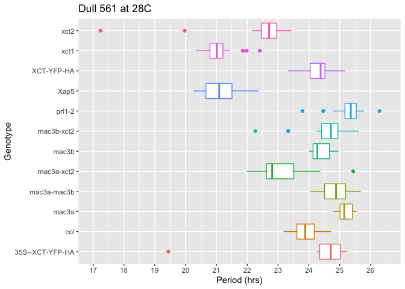

```r
library(tidyverse)
```

```
## ── Attaching packages ─────────────────────── tidyverse 1.3.0 ──
```

```
## ✔ ggplot2 3.2.1     ✔ purrr   0.3.3
## ✔ tibble  2.1.3     ✔ dplyr   0.8.5
## ✔ tidyr   1.0.2     ✔ stringr 1.4.0
## ✔ readr   1.3.1     ✔ forcats 0.4.0
```

```
## ── Conflicts ────────────────────────── tidyverse_conflicts() ──
## ✖ dplyr::filter() masks stats::filter()
## ✖ dplyr::lag()    masks stats::lag()
```

```r
library(ggplot2)

rawdata <- read.csv("Dull_561_PeriodAnalysis copy.csv", col.names = c("genotype", "period", "RAE"))
nicedata <- filter(rawdata, RAE < .6)

nicedata$names <- factor(nicedata, levels=c("col", "xct1", "xct2", "Xap5", "XCT-YFP-HA", "prl1-2", "mac3a", "mac3b","mac3a-xct2","mac3b-xct2","mac3a-mac3b","35S--XCT-YFP-HA"))

by_genotype <- nicedata %>% group_by(genotype)


ggplot(data = by_genotype) +
  geom_boxplot(mapping = aes(x=genotype, y=period, color = genotype)) + 
  coord_flip() +
  labs(title = "Dull 561 at 28C", x = "Genotype", y ="Period (hrs)") + 
  scale_y_continuous(breaks = c(17: 27), limits = c(17, 26.5)) +
  theme(legend.position = "none")
```

<!-- -->
