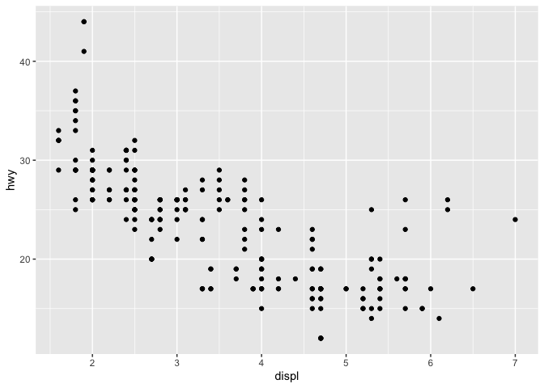

## 4.4 Exercises

1. Why is this code wrong? 
    - The second line of code spelled 'variable' with a '1' for the 'i'
    
2. Tweaked code:
    - Changed 'dota' to 'data'
    - Changed 'cyl = 8' to 'cyl == 8'
    - Changed 'diamond' to 'diamonds' 
    

```r
ggplot(data=mpg)+geom_point(mapping = aes(x=displ,y=hwy))
```

<!-- -->

```r
filter(mpg, cyl == 8)
```

```
## # A tibble: 70 x 11
##    manufacturer model displ  year   cyl trans drv     cty   hwy fl    class
##    <chr>        <chr> <dbl> <int> <int> <chr> <chr> <int> <int> <chr> <chr>
##  1 audi         a6 q…   4.2  2008     8 auto… 4        16    23 p     mids…
##  2 chevrolet    c150…   5.3  2008     8 auto… r        14    20 r     suv  
##  3 chevrolet    c150…   5.3  2008     8 auto… r        11    15 e     suv  
##  4 chevrolet    c150…   5.3  2008     8 auto… r        14    20 r     suv  
##  5 chevrolet    c150…   5.7  1999     8 auto… r        13    17 r     suv  
##  6 chevrolet    c150…   6    2008     8 auto… r        12    17 r     suv  
##  7 chevrolet    corv…   5.7  1999     8 manu… r        16    26 p     2sea…
##  8 chevrolet    corv…   5.7  1999     8 auto… r        15    23 p     2sea…
##  9 chevrolet    corv…   6.2  2008     8 manu… r        16    26 p     2sea…
## 10 chevrolet    corv…   6.2  2008     8 auto… r        15    25 p     2sea…
## # … with 60 more rows
```

```r
filter(diamonds, carat > 3)
```

```
## # A tibble: 32 x 10
##    carat cut     color clarity depth table price     x     y     z
##    <dbl> <ord>   <ord> <ord>   <dbl> <dbl> <int> <dbl> <dbl> <dbl>
##  1  3.01 Premium I     I1       62.7    58  8040  9.1   8.97  5.67
##  2  3.11 Fair    J     I1       65.9    57  9823  9.15  9.02  5.98
##  3  3.01 Premium F     I1       62.2    56  9925  9.24  9.13  5.73
##  4  3.05 Premium E     I1       60.9    58 10453  9.26  9.25  5.66
##  5  3.02 Fair    I     I1       65.2    56 10577  9.11  9.02  5.91
##  6  3.01 Fair    H     I1       56.1    62 10761  9.54  9.38  5.31
##  7  3.65 Fair    H     I1       67.1    53 11668  9.53  9.48  6.38
##  8  3.24 Premium H     I1       62.1    58 12300  9.44  9.4   5.85
##  9  3.22 Ideal   I     I1       62.6    55 12545  9.49  9.42  5.92
## 10  3.5  Ideal   H     I1       62.8    57 12587  9.65  9.59  6.03
## # … with 22 more rows
```

## 5.2.4 Exercises

1. Find all flights that:
    - Had an arrival delay of two or more hours

```r
filter(flights, arr_delay >= 120)
```

```
## # A tibble: 10,200 x 19
##     year month   day dep_time sched_dep_time dep_delay arr_time
##    <int> <int> <int>    <int>          <int>     <dbl>    <int>
##  1  2013     1     1      811            630       101     1047
##  2  2013     1     1      848           1835       853     1001
##  3  2013     1     1      957            733       144     1056
##  4  2013     1     1     1114            900       134     1447
##  5  2013     1     1     1505           1310       115     1638
##  6  2013     1     1     1525           1340       105     1831
##  7  2013     1     1     1549           1445        64     1912
##  8  2013     1     1     1558           1359       119     1718
##  9  2013     1     1     1732           1630        62     2028
## 10  2013     1     1     1803           1620       103     2008
## # … with 10,190 more rows, and 12 more variables: sched_arr_time <int>,
## #   arr_delay <dbl>, carrier <chr>, flight <int>, tailnum <chr>,
## #   origin <chr>, dest <chr>, air_time <dbl>, distance <dbl>, hour <dbl>,
## #   minute <dbl>, time_hour <dttm>
```

    - Departed in the summer (July, August, September)

```r
filter(flights, month == 7|  month == 8| month == 9)
```

```
## # A tibble: 86,326 x 19
##     year month   day dep_time sched_dep_time dep_delay arr_time
##    <int> <int> <int>    <int>          <int>     <dbl>    <int>
##  1  2013     7     1        1           2029       212      236
##  2  2013     7     1        2           2359         3      344
##  3  2013     7     1       29           2245       104      151
##  4  2013     7     1       43           2130       193      322
##  5  2013     7     1       44           2150       174      300
##  6  2013     7     1       46           2051       235      304
##  7  2013     7     1       48           2001       287      308
##  8  2013     7     1       58           2155       183      335
##  9  2013     7     1      100           2146       194      327
## 10  2013     7     1      100           2245       135      337
## # … with 86,316 more rows, and 12 more variables: sched_arr_time <int>,
## #   arr_delay <dbl>, carrier <chr>, flight <int>, tailnum <chr>,
## #   origin <chr>, dest <chr>, air_time <dbl>, distance <dbl>, hour <dbl>,
## #   minute <dbl>, time_hour <dttm>
```

    - Arrived more than two hours late, but did not depart late

```r
filter(flights, arr_delay >= 120 & dep_delay ==0)
```

```
## # A tibble: 3 x 19
##    year month   day dep_time sched_dep_time dep_delay arr_time
##   <int> <int> <int>    <int>          <int>     <dbl>    <int>
## 1  2013    10     7     1350           1350         0     1736
## 2  2013     5    23     1810           1810         0     2208
## 3  2013     7     1      905            905         0     1443
## # … with 12 more variables: sched_arr_time <int>, arr_delay <dbl>,
## #   carrier <chr>, flight <int>, tailnum <chr>, origin <chr>, dest <chr>,
## #   air_time <dbl>, distance <dbl>, hour <dbl>, minute <dbl>,
## #   time_hour <dttm>
```

    - Departed between midnight and 6am

```r
filter(flights,dep_time>=0 & dep_time <=0600)
```

```
## # A tibble: 9,344 x 19
##     year month   day dep_time sched_dep_time dep_delay arr_time
##    <int> <int> <int>    <int>          <int>     <dbl>    <int>
##  1  2013     1     1      517            515         2      830
##  2  2013     1     1      533            529         4      850
##  3  2013     1     1      542            540         2      923
##  4  2013     1     1      544            545        -1     1004
##  5  2013     1     1      554            600        -6      812
##  6  2013     1     1      554            558        -4      740
##  7  2013     1     1      555            600        -5      913
##  8  2013     1     1      557            600        -3      709
##  9  2013     1     1      557            600        -3      838
## 10  2013     1     1      558            600        -2      753
## # … with 9,334 more rows, and 12 more variables: sched_arr_time <int>,
## #   arr_delay <dbl>, carrier <chr>, flight <int>, tailnum <chr>,
## #   origin <chr>, dest <chr>, air_time <dbl>, distance <dbl>, hour <dbl>,
## #   minute <dbl>, time_hour <dttm>
```

2. Simplifying code with between()


```r
filter(flights, between(dep_time,0600,2359))
```

```
## # A tibble: 319,762 x 19
##     year month   day dep_time sched_dep_time dep_delay arr_time
##    <int> <int> <int>    <int>          <int>     <dbl>    <int>
##  1  2013     1     1      600            600         0      851
##  2  2013     1     1      600            600         0      837
##  3  2013     1     1      601            600         1      844
##  4  2013     1     1      602            610        -8      812
##  5  2013     1     1      602            605        -3      821
##  6  2013     1     1      606            610        -4      858
##  7  2013     1     1      606            610        -4      837
##  8  2013     1     1      607            607         0      858
##  9  2013     1     1      608            600         8      807
## 10  2013     1     1      611            600        11      945
## # … with 319,752 more rows, and 12 more variables: sched_arr_time <int>,
## #   arr_delay <dbl>, carrier <chr>, flight <int>, tailnum <chr>,
## #   origin <chr>, dest <chr>, air_time <dbl>, distance <dbl>, hour <dbl>,
## #   minute <dbl>, time_hour <dttm>
```

3. How many flights have a missing dep_time? What other variables are missing? What might these rows represent?
    - There are 8225 flights with a missing departure time
    - arr_time, air_time, and dep_delay are also missing
    

```r
filter(flights, is.na(dep_time))
```

```
## # A tibble: 8,255 x 19
##     year month   day dep_time sched_dep_time dep_delay arr_time
##    <int> <int> <int>    <int>          <int>     <dbl>    <int>
##  1  2013     1     1       NA           1630        NA       NA
##  2  2013     1     1       NA           1935        NA       NA
##  3  2013     1     1       NA           1500        NA       NA
##  4  2013     1     1       NA            600        NA       NA
##  5  2013     1     2       NA           1540        NA       NA
##  6  2013     1     2       NA           1620        NA       NA
##  7  2013     1     2       NA           1355        NA       NA
##  8  2013     1     2       NA           1420        NA       NA
##  9  2013     1     2       NA           1321        NA       NA
## 10  2013     1     2       NA           1545        NA       NA
## # … with 8,245 more rows, and 12 more variables: sched_arr_time <int>,
## #   arr_delay <dbl>, carrier <chr>, flight <int>, tailnum <chr>,
## #   origin <chr>, dest <chr>, air_time <dbl>, distance <dbl>, hour <dbl>,
## #   minute <dbl>, time_hour <dttm>
```

## 5.3.1 Exercises

1. Use arrange() to sort all NA values to the start 

```r
arrange(flights, desc(is.na(dep_time)), dep_time)
```

```
## # A tibble: 336,776 x 19
##     year month   day dep_time sched_dep_time dep_delay arr_time
##    <int> <int> <int>    <int>          <int>     <dbl>    <int>
##  1  2013     1     1       NA           1630        NA       NA
##  2  2013     1     1       NA           1935        NA       NA
##  3  2013     1     1       NA           1500        NA       NA
##  4  2013     1     1       NA            600        NA       NA
##  5  2013     1     2       NA           1540        NA       NA
##  6  2013     1     2       NA           1620        NA       NA
##  7  2013     1     2       NA           1355        NA       NA
##  8  2013     1     2       NA           1420        NA       NA
##  9  2013     1     2       NA           1321        NA       NA
## 10  2013     1     2       NA           1545        NA       NA
## # … with 336,766 more rows, and 12 more variables: sched_arr_time <int>,
## #   arr_delay <dbl>, carrier <chr>, flight <int>, tailnum <chr>,
## #   origin <chr>, dest <chr>, air_time <dbl>, distance <dbl>, hour <dbl>,
## #   minute <dbl>, time_hour <dttm>
```

2. Find the most delayed flights and the flights that left the earliest. 

```r
arrange(flights,dep_delay)
```

```
## # A tibble: 336,776 x 19
##     year month   day dep_time sched_dep_time dep_delay arr_time
##    <int> <int> <int>    <int>          <int>     <dbl>    <int>
##  1  2013    12     7     2040           2123       -43       40
##  2  2013     2     3     2022           2055       -33     2240
##  3  2013    11    10     1408           1440       -32     1549
##  4  2013     1    11     1900           1930       -30     2233
##  5  2013     1    29     1703           1730       -27     1947
##  6  2013     8     9      729            755       -26     1002
##  7  2013    10    23     1907           1932       -25     2143
##  8  2013     3    30     2030           2055       -25     2213
##  9  2013     3     2     1431           1455       -24     1601
## 10  2013     5     5      934            958       -24     1225
## # … with 336,766 more rows, and 12 more variables: sched_arr_time <int>,
## #   arr_delay <dbl>, carrier <chr>, flight <int>, tailnum <chr>,
## #   origin <chr>, dest <chr>, air_time <dbl>, distance <dbl>, hour <dbl>,
## #   minute <dbl>, time_hour <dttm>
```

```r
arrange(flights, desc(dep_delay))
```

```
## # A tibble: 336,776 x 19
##     year month   day dep_time sched_dep_time dep_delay arr_time
##    <int> <int> <int>    <int>          <int>     <dbl>    <int>
##  1  2013     1     9      641            900      1301     1242
##  2  2013     6    15     1432           1935      1137     1607
##  3  2013     1    10     1121           1635      1126     1239
##  4  2013     9    20     1139           1845      1014     1457
##  5  2013     7    22      845           1600      1005     1044
##  6  2013     4    10     1100           1900       960     1342
##  7  2013     3    17     2321            810       911      135
##  8  2013     6    27      959           1900       899     1236
##  9  2013     7    22     2257            759       898      121
## 10  2013    12     5      756           1700       896     1058
## # … with 336,766 more rows, and 12 more variables: sched_arr_time <int>,
## #   arr_delay <dbl>, carrier <chr>, flight <int>, tailnum <chr>,
## #   origin <chr>, dest <chr>, air_time <dbl>, distance <dbl>, hour <dbl>,
## #   minute <dbl>, time_hour <dttm>
```

3. Find the fastest flights

```r
arrange(flights,air_time)
```

```
## # A tibble: 336,776 x 19
##     year month   day dep_time sched_dep_time dep_delay arr_time
##    <int> <int> <int>    <int>          <int>     <dbl>    <int>
##  1  2013     1    16     1355           1315        40     1442
##  2  2013     4    13      537            527        10      622
##  3  2013    12     6      922            851        31     1021
##  4  2013     2     3     2153           2129        24     2247
##  5  2013     2     5     1303           1315       -12     1342
##  6  2013     2    12     2123           2130        -7     2211
##  7  2013     3     2     1450           1500       -10     1547
##  8  2013     3     8     2026           1935        51     2131
##  9  2013     3    18     1456           1329        87     1533
## 10  2013     3    19     2226           2145        41     2305
## # … with 336,766 more rows, and 12 more variables: sched_arr_time <int>,
## #   arr_delay <dbl>, carrier <chr>, flight <int>, tailnum <chr>,
## #   origin <chr>, dest <chr>, air_time <dbl>, distance <dbl>, hour <dbl>,
## #   minute <dbl>, time_hour <dttm>
```

4. Which flights travelled the furtherst? Which flights travelled the shortest?

```r
arrange(flights,desc(distance))
```

```
## # A tibble: 336,776 x 19
##     year month   day dep_time sched_dep_time dep_delay arr_time
##    <int> <int> <int>    <int>          <int>     <dbl>    <int>
##  1  2013     1     1      857            900        -3     1516
##  2  2013     1     2      909            900         9     1525
##  3  2013     1     3      914            900        14     1504
##  4  2013     1     4      900            900         0     1516
##  5  2013     1     5      858            900        -2     1519
##  6  2013     1     6     1019            900        79     1558
##  7  2013     1     7     1042            900       102     1620
##  8  2013     1     8      901            900         1     1504
##  9  2013     1     9      641            900      1301     1242
## 10  2013     1    10      859            900        -1     1449
## # … with 336,766 more rows, and 12 more variables: sched_arr_time <int>,
## #   arr_delay <dbl>, carrier <chr>, flight <int>, tailnum <chr>,
## #   origin <chr>, dest <chr>, air_time <dbl>, distance <dbl>, hour <dbl>,
## #   minute <dbl>, time_hour <dttm>
```

```r
arrange(flights, distance)
```

```
## # A tibble: 336,776 x 19
##     year month   day dep_time sched_dep_time dep_delay arr_time
##    <int> <int> <int>    <int>          <int>     <dbl>    <int>
##  1  2013     7    27       NA            106        NA       NA
##  2  2013     1     3     2127           2129        -2     2222
##  3  2013     1     4     1240           1200        40     1333
##  4  2013     1     4     1829           1615       134     1937
##  5  2013     1     4     2128           2129        -1     2218
##  6  2013     1     5     1155           1200        -5     1241
##  7  2013     1     6     2125           2129        -4     2224
##  8  2013     1     7     2124           2129        -5     2212
##  9  2013     1     8     2127           2130        -3     2304
## 10  2013     1     9     2126           2129        -3     2217
## # … with 336,766 more rows, and 12 more variables: sched_arr_time <int>,
## #   arr_delay <dbl>, carrier <chr>, flight <int>, tailnum <chr>,
## #   origin <chr>, dest <chr>, air_time <dbl>, distance <dbl>, hour <dbl>,
## #   minute <dbl>, time_hour <dttm>
```

## 5.4.1 Exercises

1. Ways to select dep_time, dep_delay, arr_time, and arr_delay from flights.

```r
select(flights, dep_time, dep_delay, arr_time, arr_delay)
```

```
## # A tibble: 336,776 x 4
##    dep_time dep_delay arr_time arr_delay
##       <int>     <dbl>    <int>     <dbl>
##  1      517         2      830        11
##  2      533         4      850        20
##  3      542         2      923        33
##  4      544        -1     1004       -18
##  5      554        -6      812       -25
##  6      554        -4      740        12
##  7      555        -5      913        19
##  8      557        -3      709       -14
##  9      557        -3      838        -8
## 10      558        -2      753         8
## # … with 336,766 more rows
```

```r
select(flights, starts_with("arr"), starts_with("dep"))
```

```
## # A tibble: 336,776 x 4
##    arr_time arr_delay dep_time dep_delay
##       <int>     <dbl>    <int>     <dbl>
##  1      830        11      517         2
##  2      850        20      533         4
##  3      923        33      542         2
##  4     1004       -18      544        -1
##  5      812       -25      554        -6
##  6      740        12      554        -4
##  7      913        19      555        -5
##  8      709       -14      557        -3
##  9      838        -8      557        -3
## 10      753         8      558        -2
## # … with 336,766 more rows
```

```r
x <- c("dep_time","dep_delay","arr_time","arr_delay")
select(flights,one_of(x))
```

```
## # A tibble: 336,776 x 4
##    dep_time dep_delay arr_time arr_delay
##       <int>     <dbl>    <int>     <dbl>
##  1      517         2      830        11
##  2      533         4      850        20
##  3      542         2      923        33
##  4      544        -1     1004       -18
##  5      554        -6      812       -25
##  6      554        -4      740        12
##  7      555        -5      913        19
##  8      557        -3      709       -14
##  9      557        -3      838        -8
## 10      558        -2      753         8
## # … with 336,766 more rows
```

2. What happens if you include the name of a variable multiple times in a select() call?
    - The variable is only shown once

```r
select(flights,dep_time,dep_time)
```

```
## # A tibble: 336,776 x 1
##    dep_time
##       <int>
##  1      517
##  2      533
##  3      542
##  4      544
##  5      554
##  6      554
##  7      555
##  8      557
##  9      557
## 10      558
## # … with 336,766 more rows
```

3. What does the one_of() function do? Why might it be helpful in conjunction with this vector?
    - One_of allows you to select all the elements described in one variable

```r
vars <- c("year", "month", "day", "dep_delay", "arr_delay")
select(flights,one_of(vars))
```

```
## # A tibble: 336,776 x 5
##     year month   day dep_delay arr_delay
##    <int> <int> <int>     <dbl>     <dbl>
##  1  2013     1     1         2        11
##  2  2013     1     1         4        20
##  3  2013     1     1         2        33
##  4  2013     1     1        -1       -18
##  5  2013     1     1        -6       -25
##  6  2013     1     1        -4        12
##  7  2013     1     1        -5        19
##  8  2013     1     1        -3       -14
##  9  2013     1     1        -3        -8
## 10  2013     1     1        -2         8
## # … with 336,766 more rows
```

4. Does the result of running the following code surprise you? How do the select helpers deal with case by default? How can you change that default?
    - Select ignores case differences

```r
select(flights, contains("TIME"))
```

```
## # A tibble: 336,776 x 6
##    dep_time sched_dep_time arr_time sched_arr_time air_time
##       <int>          <int>    <int>          <int>    <dbl>
##  1      517            515      830            819      227
##  2      533            529      850            830      227
##  3      542            540      923            850      160
##  4      544            545     1004           1022      183
##  5      554            600      812            837      116
##  6      554            558      740            728      150
##  7      555            600      913            854      158
##  8      557            600      709            723       53
##  9      557            600      838            846      140
## 10      558            600      753            745      138
## # … with 336,766 more rows, and 1 more variable: time_hour <dttm>
```

## 5.5.2 Exercises
1. Currently dep_time and sched_dep_time are convenient to look at, but hard to compute with because they’re not really continuous numbers. Convert them to a more convenient representation of number of minutes since midnight.

```r
departures <- select(flights, dep_time,sched_dep_time)

mutate(departures,
       dep_time_min = (dep_time%/%100)*60 + (dep_time%%100),
       sched_dep_time_min = (sched_dep_time%/%100)*60 + (sched_dep_time%%100)
)
```

```
## # A tibble: 336,776 x 4
##    dep_time sched_dep_time dep_time_min sched_dep_time_min
##       <int>          <int>        <dbl>              <dbl>
##  1      517            515          317                315
##  2      533            529          333                329
##  3      542            540          342                340
##  4      544            545          344                345
##  5      554            600          354                360
##  6      554            558          354                358
##  7      555            600          355                360
##  8      557            600          357                360
##  9      557            600          357                360
## 10      558            600          358                360
## # … with 336,766 more rows
```

2. Compare air_time with arr_time - dep_time. What do you expect to see? What do you see? What do you need to do to fix it?
    - I expect them to be equal 
    - **You need to convert the arrival and departure time to minute. Why isn't air_time the difference in minutes between the two?**

```r
times <- select(flights, dep_time,arr_time, air_time)
times
```

```
## # A tibble: 336,776 x 3
##    dep_time arr_time air_time
##       <int>    <int>    <dbl>
##  1      517      830      227
##  2      533      850      227
##  3      542      923      160
##  4      544     1004      183
##  5      554      812      116
##  6      554      740      150
##  7      555      913      158
##  8      557      709       53
##  9      557      838      140
## 10      558      753      138
## # … with 336,766 more rows
```

```r
transmute(times,
       dep_time_min = (dep_time%/%100)*60 + (dep_time%%100),
       arr_time_min = (arr_time%/%100)*60 + (arr_time%%100),
       air_time_new = arr_time_min - dep_time_min)
```

```
## # A tibble: 336,776 x 3
##    dep_time_min arr_time_min air_time_new
##           <dbl>        <dbl>        <dbl>
##  1          317          510          193
##  2          333          530          197
##  3          342          563          221
##  4          344          604          260
##  5          354          492          138
##  6          354          460          106
##  7          355          553          198
##  8          357          429           72
##  9          357          518          161
## 10          358          473          115
## # … with 336,766 more rows
```

3. Compare dep_time, sched_dep_time, and dep_delay. How would you expect those three numbers to be related?
    - Expect dep_delay = sched_dep_time (in min) - dep_time (in min)
  

4. **Find the 10 most delayed flights using a ranking function. How do you want to handle ties? Carefully read the documentation for min_rank().**

```
x<- select(flights,arr_delay)
min_rank(desc(x))
```

5. What does 1:3 + 1:10 return? Why?
    - It returned 2, 4, 6, 5, 7, 9, 8, 10, 12, 11 because the 1:3 gets cycled as many times as it needs to complete the operation 

## Exercise 5.6.7
5. Which carrier has the worst delays? Challenge: can you disentangle the effects of bad airports vs. bad carriers? Why/why not? (Hint: think about flights %>% group_by(carrier, dest) %>% summarise(n()))
    **What does %>% do?**
    
    
    
    
