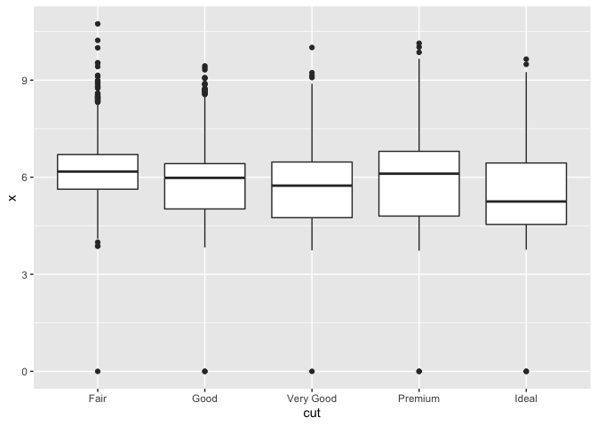

## 7.3.4 Problems
1. Explore the distribution of each of the x, y, and z variables in diamonds. What do you learn? Think about a diamond and how you might decide which dimension is the length, width, and depth.

```r
 ggplot(data = diamonds) +
     geom_histogram(mapping = aes(x = x), binwidth =1) 
```

<!-- -->

```r
 ggplot(data = diamonds) +
     geom_histogram(mapping = aes(x = y), binwidth = 1) 
```

<!-- -->

```r
 ggplot(data = diamonds) +
     geom_histogram(mapping = aes(x = z), binwidth =1) 
```

<!-- -->

  + Fron the distributions, x has the smallest variation, and y and z have similar variations. 
  + I looked up '?diamonds' to determine which dimension is the length (x), width (y), and depth (z). 
  + If I couldn't look up which dimension corresponded to a variable, I would infer that the the width and depth must be y and z because they are similar. 

2. Explore the distribution of price. Do you discover anything unusual or surprising? (Hint: Carefully think about the binwidth and make sure you try a wide range of values.)
  + The binwith for the distribution must be very large because price rances from about 300 to almost 20,000

3. How many diamonds are 0.99 carat? How many are 1 carat? What do you think is the cause of the difference?


```r
filter(diamonds, carat == .99) %>% count()
```

```
## # A tibble: 1 x 1
##       n
##   <int>
## 1    23
```

```r
filter(diamonds, carat == 1) %>% count()
```

```
## # A tibble: 1 x 1
##       n
##   <int>
## 1  1558
```

  + There are 23 diamonds that are 0.99 carat and 1,558 diamonds that are 1 carat
  + This difference might be because of rounding? 

4. Compare and contrast coord_cartesian() vs xlim() or ylim() when zooming in on a histogram. What happens if you leave binwidth unset? What happens if you try and zoom so only half a bar shows?
  + When binwidth is unset the function automatically picks a binwidth for you
  +  When you try to zoom in to half a bar with xlim it cuts out all the other values

## 7.4.1 Problems
1. What happens to missing values in a histogram? What happens to missing values in a bar chart? Why is there a difference?
  + The histogram just ignores the missing values, whereas the bar chart creates its own separate category for the NA values

1. What does na.rm = TRUE do in mean() and sum()?
  + na.rm ignores missing values when calulating the mean and sum

## 7.5.1.1 Problems
1. Use what you’ve learned to improve the visualisation of the departure times of cancelled vs. non-cancelled flights. __Couldn't figure out how to get them on the same plot__


```r
 flights %>% 
     mutate(cancelled = is.na(dep_time)) %>% 
     ggplot() +
     geom_boxplot(aes(x = cancelled, y = dep_time)) 
```

```
## Warning: Removed 8255 rows containing non-finite values (stat_boxplot).
```

<!-- -->

```r
flights %>% 
     mutate(notcancelled = !is.na(dep_time)) %>% 
     ggplot() +
     geom_boxplot(aes(x = notcancelled, y = dep_time)) 
```

```
## Warning: Removed 8255 rows containing non-finite values (stat_boxplot).
```

<!-- -->

2. What variable in the diamonds dataset is most important for predicting the price of a diamond? How is that variable correlated with cut? Why does the combination of those two relationships lead to lower quality diamonds being more expensive?

```r
diamonds %>% 
    ggplot() +
    geom_point(aes(x = carat, y = price)) 
```

<!-- -->

```r
diamonds %>% 
    ggplot() +
    geom_point(aes(x = depth, y = price)) 
```

<!-- -->

```r
diamonds %>% 
    ggplot() +
    geom_point(aes(x = x, y = price)) 
```

<!-- -->

```r
diamonds %>% 
    ggplot() +
    geom_point(aes(x = y, y = price)) 
```

<!-- -->

```r
diamonds %>% 
    ggplot() +
    geom_point(aes(x = z, y = price)) 
```

<!-- -->
 
  + It looks like carat or length is the most important varable for predicting the price of a diamond since you can see some kind of correlation


```r
diamonds %>% 
    ggplot() +
    geom_boxplot(aes(x = cut, y = carat)) 
```

<!-- -->

```r
diamonds %>% 
    ggplot() +
    geom_boxplot(aes(x = cut, y = x)) 
```

<!-- -->
  
  + It seems like lower quality diamonds can be more expensive because lower quality diamonds have a higher carat value.

3. Install the ggstance package, and create a horizontal boxplot. How does this compare to using coord_flip()?

```r
diamonds %>% 
    ggplot() +
    geom_boxplot(aes(x = cut, y = carat )) + coord_flip()
```

<!-- -->

```r
 diamonds %>% 
    ggplot() +
   geom_boxploth(aes(x = carat, y = cut )) 
```

<!-- -->
  + The ggstance horizontal boxplot uses the x variable that is usually the y in coord_flip on the x axis and vice versa, while the coord flip keeps the varibles the same, but literally flips the graph

4. Compare and contrast geom_violin() with a facetted geom_histogram(), or a coloured geom_freqpoly(). What are the pros and cons of each method?

```r
diamonds %>% 
  ggplot() +
  geom_violin(aes(x= cut, y = price)) 
```

<!-- -->

```r
diamonds %>% 
     ggplot() +
  geom_histogram(aes(x = price)) +
  facet_wrap(~cut)
```

```
## `stat_bin()` using `bins = 30`. Pick better value with `binwidth`.
```

<!-- -->

```r
diamonds %>% 
  ggplot() +
  geom_freqpoly(aes(x= price)) +
  facet_wrap(~cut)
```

```
## `stat_bin()` using `bins = 30`. Pick better value with `binwidth`.
```

<!-- -->

5. If you have a small dataset, it’s sometimes useful to use geom_jitter() to see the relationship between a continuous and categorical variable. The ggbeeswarm package provides a number of methods similar to geom_jitter(). List them and briefly describe what each one does.

## Hypothetical Experiment
  - Categorical Variables
    - Analyze the covariation in eye color and hair color 
    - Record eye color and hair color of individuals within a defined population
    
  - Continuous Variables
    - Analyze the covariation between height and the number of seeds a plant produces
    - Grow plants of the same genotype in identical environments 
    - Record heights of plants and the number of seeds produced by each plant 
    
    
