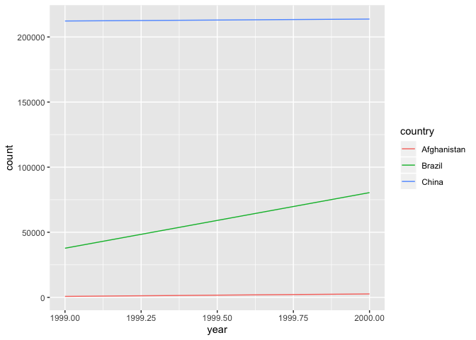

## 12.2.1 Problems 
2. Compute the rate for table2, and table4a + table4b. You will need to perform four operations:
    - Extract the number of TB cases per country per year.
    - Extract the matching population per country per year.
    - Divide cases by population, and multiply by 10000.
    - Store back in the appropriate place.
    - Which representation is easiest to work with? Which is hardest? Why?
      - The two separate tables were easier to work with because the population and TB cases per year are separated

```r
 filter(table2, type == "cases") 
```

```
## # A tibble: 6 x 4
##   country      year type   count
##   <chr>       <int> <chr>  <int>
## 1 Afghanistan  1999 cases    745
## 2 Afghanistan  2000 cases   2666
## 3 Brazil       1999 cases  37737
## 4 Brazil       2000 cases  80488
## 5 China        1999 cases 212258
## 6 China        2000 cases 213766
```

```r
 filter(table2, type == "population") 
```

```
## # A tibble: 6 x 4
##   country      year type            count
##   <chr>       <int> <chr>           <int>
## 1 Afghanistan  1999 population   19987071
## 2 Afghanistan  2000 population   20595360
## 3 Brazil       1999 population  172006362
## 4 Brazil       2000 population  174504898
## 5 China        1999 population 1272915272
## 6 China        2000 population 1280428583
```

```r
cases <- select (table4a, '1999', '2000')
population <- select(table4b, '1999', '2000')
rates <- (cases/population)*(10000)
rate <- tibble (rates)

new <- tibble(
  country = table4a$country,
  '1999' = rates$'1999',
  '2000' = rates$'2000'
      )

print(new)
```

```
## # A tibble: 3 x 3
##   country     `1999` `2000`
##   <chr>        <dbl>  <dbl>
## 1 Afghanistan  0.373   1.29
## 2 Brazil       2.19    4.61
## 3 China        1.67    1.67
```

3. Recreate the plot showing change in cases over time using table2 instead of table1. What do you need to do first?


```r
table2 %>%
  filter(type == "cases") %>%
  ggplot(aes(year, count)) +
  geom_line(aes(group = country, color = country))
```

<!-- -->

## 12.3.3 Problems
1. Why are pivot_longer() and pivot_wider() not perfectly symmetrical?


```r
stocks <- tibble(
  year   = c(2015, 2015, 2016, 2016),
  half  = c(   1,    2,     1,    2),
  return = c(1.88, 0.59, 0.92, 0.17)
)

stocks %>% 
  pivot_wider(names_from = year, values_from = return) 
```

```
## # A tibble: 2 x 3
##    half `2015` `2016`
##   <dbl>  <dbl>  <dbl>
## 1     1   1.88   0.92
## 2     2   0.59   0.17
```


```r
stocks <- tibble(
  year   = c(2015, 2015, 2016, 2016),
  half  = c(   1,    2,     1,    2),
  return = c(1.88, 0.59, 0.92, 0.17)
)

stocks %>% 
  pivot_wider(names_from = year, values_from = return) %>% 
  pivot_longer(`2015`:`2016`, names_to = "year", values_to = "return")
```

```
## # A tibble: 4 x 3
##    half year  return
##   <dbl> <chr>  <dbl>
## 1     1 2015    1.88
## 2     1 2016    0.92
## 3     2 2015    0.59
## 4     2 2016    0.17
```
    - pivot_wider creates separate columns for each year while pivot_longer creates a year column with both the separate years
    - pivot_longer() has a names_ptype argument, e.g. names_ptype = list(year = double()). What does it do?
    - I think it converts the year to a number instead of a character 

2. Why does this code fail?

```r
##table4a %>% 
  ##pivot_longer(c(1999, 2000), names_to = "year", values_to = "cases")
#> Error: Can't subset columns that don't exist.
#> ✖ The locations 1999 and 2000 don't exist.
#> ℹ There are only 3 columns.
```
    - There are no backticks around the years

3. What would happen if you widen this table? Why? How could you add a new column to uniquely identify each value?
    - If you try to widen this table Phillip Woods would receive two ages (?)
    

```r
people <- tribble(
  ~name,             ~names,  ~values,
  #-----------------|--------|------
  "Phillip Woods",   "age",       45,
  "Phillip Woods",   "height",   186,
  "Phillip Woods",   "age",       50,
  "Jessica Cordero", "age",       37,
  "Jessica Cordero", "height",   156
  

)%>%
pivot_wider(names_from= names, values_from= values)
```

```
## Warning: Values in `values` are not uniquely identified; output will contain list-cols.
## * Use `values_fn = list(values = list)` to suppress this warning.
## * Use `values_fn = list(values = length)` to identify where the duplicates arise
## * Use `values_fn = list(values = summary_fun)` to summarise duplicates
```

```r
print(people)
```

```
## # A tibble: 2 x 3
##   name            age       height   
##   <chr>           <list>    <list>   
## 1 Phillip Woods   <dbl [2]> <dbl [1]>
## 2 Jessica Cordero <dbl [1]> <dbl [1]>
```

4. Tidy the simple tibble below. Do you need to make it wider or longer? What are the variables?
    - We can make it longer 

```r
preg <- tribble(
  ~pregnant, ~male, ~female,
  "yes",     NA,    10,
  "no",      20,    12
)%>% print() %>%
  pivot_longer(c('male', 'female'), names_to = "gender", values_to = "count")
```

```
## # A tibble: 2 x 3
##   pregnant  male female
##   <chr>    <dbl>  <dbl>
## 1 yes         NA     10
## 2 no          20     12
```

```r
print(preg)
```

```
## # A tibble: 4 x 3
##   pregnant gender count
##   <chr>    <chr>  <dbl>
## 1 yes      male      NA
## 2 yes      female    10
## 3 no       male      20
## 4 no       female    12
```

## 12.4.3 Problems
1. What do the extra and fill arguments do in separate()? Experiment with the various options for the following two toy datasets.
    - extra controls character vectors and drops or splits apart extra values (warn drops extra values)
    - fill controls chracter vectors when there are not enough pieces (warn fills missing values from the right)


```r
tibble(x = c("a,b,c", "d,e,f,g", "h,i,j")) %>% 
  separate(x, c("one", "two", "three"), extra = "warn")
```

```
## Warning: Expected 3 pieces. Additional pieces discarded in 1 rows [2].
```

```
## # A tibble: 3 x 3
##   one   two   three
##   <chr> <chr> <chr>
## 1 a     b     c    
## 2 d     e     f    
## 3 h     i     j
```

```r
tibble(x = c("a,b,c", "d,e", "f,g,i")) %>% 
  separate(x, c("one", "two", "three"), fill = "right")
```

```
## # A tibble: 3 x 3
##   one   two   three
##   <chr> <chr> <chr>
## 1 a     b     c    
## 2 d     e     <NA> 
## 3 f     g     i
```

2. Both unite() and separate() have a remove argument. What does it do? Why would you set it to FALSE?
    - Remove eliminates the original columns you joined with unite() and keeps the column you separated 
      - You would set it to FALSE if you want to see what values the new united column came from and what the separated columns came from
     

```r
table5 %>% 
  unite(new, century, year, remove = FALSE)
```

```
## # A tibble: 6 x 5
##   country     new   century year  rate             
##   <chr>       <chr> <chr>   <chr> <chr>            
## 1 Afghanistan 19_99 19      99    745/19987071     
## 2 Afghanistan 20_00 20      00    2666/20595360    
## 3 Brazil      19_99 19      99    37737/172006362  
## 4 Brazil      20_00 20      00    80488/174504898  
## 5 China       19_99 19      99    212258/1272915272
## 6 China       20_00 20      00    213766/1280428583
```

```r
table3 %>% 
  separate(rate, into = c("cases", "population"), remove=FALSE)
```

```
## # A tibble: 6 x 5
##   country      year rate              cases  population
##   <chr>       <int> <chr>             <chr>  <chr>     
## 1 Afghanistan  1999 745/19987071      745    19987071  
## 2 Afghanistan  2000 2666/20595360     2666   20595360  
## 3 Brazil       1999 37737/172006362   37737  172006362 
## 4 Brazil       2000 80488/174504898   80488  174504898 
## 5 China        1999 212258/1272915272 212258 1272915272
## 6 China        2000 213766/1280428583 213766 1280428583
```

3. Compare and contrast separate() and extract(). Why are there three variations of separation (by position, by separator, and with groups), but only one unite?
    - separate() splits one column into two while extract() turns each group into a column 
    - Both create columns based on existing ones
    - You can separate things in many different ways but to unite something an underscore is immediately places between each value and you can remove this in any way you want later on  

## 12.6.1 Problems
1. I claimed that iso2 and iso3 were redundant with country. Confirm this claim.
    - I'm not sure how to do this 

2. For each country, year, and sex compute the total number of cases of TB. Make an informative visualisation of the data.

```r
who1 <- who %>% 
  pivot_longer(
    cols = new_sp_m014:newrel_f65, 
    names_to = "key", 
    values_to = "cases", 
    values_drop_na = TRUE
  )
who2 <- who1 %>% 
  mutate(names_from = stringr::str_replace(key, "newrel", "new_rel"))
who3 <- who2 %>% 
  separate(key, c("new", "type", "sexage"), sep = "_")
```

```
## Warning: Expected 3 pieces. Missing pieces filled with `NA` in 2580 rows
## [243, 244, 679, 680, 681, 682, 683, 684, 685, 686, 687, 688, 689, 690, 691,
## 692, 903, 904, 905, 906, ...].
```

```r
who3 %>% 
  count(new)
```

```
## # A tibble: 2 x 2
##   new        n
##   <chr>  <int>
## 1 new    73466
## 2 newrel  2580
```

```r
who4 <- who3 %>% 
  select(-new, -iso2, -iso3)
who5 <- who4 %>% 
  separate(sexage, c("sex", "age"), sep = 1)

who5 %>%
  ggplot(
    aes(x = year, y = cases, color = sex)
    ) + 
   geom_smooth()
```

```
## `geom_smooth()` using method = 'gam' and formula 'y ~ s(x, bs = "cs")'
```

<!-- -->

