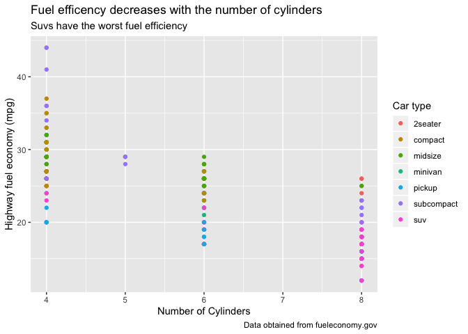
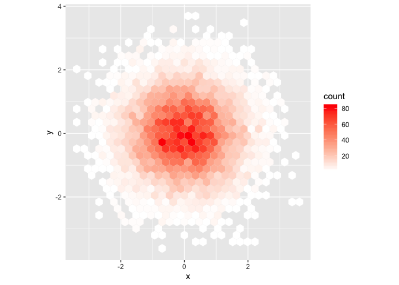
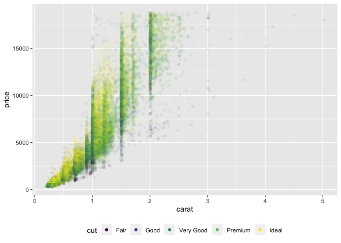

## 13.2.1 Exercises

1. Imagine you wanted to draw (approximately) the route each plane flies from its origin to its destination. What variables would you need? What tables would you need to combine?
    - You would need the plane number, the origin, and the destination, so 3 variables
    - You would need to combine flights and airports 

2. I forgot to draw the relationship between weather and airports. What is the relationship and how should it appear in the diagram?
    - Weather and airports are connected through origin in flights 

3. weather only contains information for the origin (NYC) airports. If it contained weather records for all airports in the USA, what additional relation would it define with flights?
    - It would also connect to flights via hour because of the different time zones? 

4. We know that some days of the year are “special”, and fewer people than usual fly on them. How might you represent that data as a data frame? What would be the primary keys of that table? How would it connect to the existing tables?
    - You could create a data frame with the special days then this can connect to flights 
    
## 13.3.1 Exercises 
1. Add a surrogate key to flights

```r
flights %>%
  arrange(year, month, day, sched_dep_time, carrier, flight) %>%
  mutate(flight_id = row_number()) 
```

```
## # A tibble: 336,776 x 20
##     year month   day dep_time sched_dep_time dep_delay arr_time
##    <int> <int> <int>    <int>          <int>     <dbl>    <int>
##  1  2013     1     1      517            515         2      830
##  2  2013     1     1      533            529         4      850
##  3  2013     1     1      542            540         2      923
##  4  2013     1     1      544            545        -1     1004
##  5  2013     1     1      554            558        -4      740
##  6  2013     1     1      559            559         0      702
##  7  2013     1     1      558            600        -2      753
##  8  2013     1     1      559            600        -1      941
##  9  2013     1     1      558            600        -2      849
## 10  2013     1     1      558            600        -2      853
## # … with 336,766 more rows, and 13 more variables: sched_arr_time <int>,
## #   arr_delay <dbl>, carrier <chr>, flight <int>, tailnum <chr>,
## #   origin <chr>, dest <chr>, air_time <dbl>, distance <dbl>, hour <dbl>,
## #   minute <dbl>, time_hour <dttm>, flight_id <int>
```
2. Identify the keys in the following datasets
    - Lahman::Batting
      - Primary key: playerID + stint + yearID

```r
Lahman::Batting %>%
  count(playerID, stint, yearID) %>%
  filter(n > 1) %>%
  nrow()
```

```
## [1] 0
```
    - babynames::babynames
      - Primary key: name + sex + year

```r
babynames::babynames %>%
  count(name, sex, year) %>%
  filter(n > 1) %>%
  nrow()
```

```
## [1] 0
```

## 13.4.6 Exercises
1. Compute the average delay by destination, then join on the airports data frame so you can show the spatial distribution of delays. Here’s an easy way to draw a map of the United States:

```
avg_dest_delays <-
  flights %>%
  group_by(dest) %>%
  summarise(delay = mean(arr_delay, na.rm = TRUE)) %>%
  left_join(airports, by = c(dest = "faa"))

avg_dest_delays %>%
  ggplot(aes(lon, lat, colour = delay)) +
  borders("state") +
  geom_point() +
  coord_quickmap()
```
2. Add the location of the origin and destination (i.e. the lat and lon) to flights.
```
airport_locations <- airports %>%
  select(faa, lat, lon)

flights %>%
  select(year:day, hour, origin, dest) %>%
  left_join(
    airport_locations,
    by = c("origin" = "faa")
  ) %>%
  left_join(
    airport_locations,
    by = c("dest" = "faa")
  )
```
## 13.5.1 Exercises
2. Filter flights to only show flights with planes that have flown at least 100 flights.

```r
flights %>%
  filter(!is.na(tailnum)) %>%
  group_by(tailnum) %>%
  mutate(n = n()) %>%
  filter(n >= 100)
```

```
## # A tibble: 228,390 x 20
## # Groups:   tailnum [1,217]
##     year month   day dep_time sched_dep_time dep_delay arr_time
##    <int> <int> <int>    <int>          <int>     <dbl>    <int>
##  1  2013     1     1      517            515         2      830
##  2  2013     1     1      533            529         4      850
##  3  2013     1     1      544            545        -1     1004
##  4  2013     1     1      554            558        -4      740
##  5  2013     1     1      555            600        -5      913
##  6  2013     1     1      557            600        -3      709
##  7  2013     1     1      557            600        -3      838
##  8  2013     1     1      558            600        -2      849
##  9  2013     1     1      558            600        -2      853
## 10  2013     1     1      558            600        -2      923
## # … with 228,380 more rows, and 13 more variables: sched_arr_time <int>,
## #   arr_delay <dbl>, carrier <chr>, flight <int>, tailnum <chr>,
## #   origin <chr>, dest <chr>, air_time <dbl>, distance <dbl>, hour <dbl>,
## #   minute <dbl>, time_hour <dttm>, n <int>
```
4. Find the 48 hours (over the course of the whole year) that have the worst delays. Cross-reference it with the weather data. Can you see any patterns?


## 28.2.2 Exercises
1. Create one plot on the fuel economy data with customised title, subtitle, caption, x, y, and colour labels.

```r
ggplot(mpg, aes(cyl, hwy)) +
  geom_point(aes(colour = class)) +
  
  labs(
   title =  "Fuel efficency decreases with the number of cylinders",
   subtitle = "Suvs have the worst fuel efficiency",
   caption = "Data obtained from fueleconomy.gov",
    x = "Number of Cylinders",
    y = "Highway fuel economy (mpg)",
    colour = "Car type"
  )
```

<!-- -->

## 28.4.4 
1. Why doesn’t the following code override the default scale?
    - The color in the geom_hex is set by fill not colour

```r
df <- tibble(
  x = rnorm(10000),
  y = rnorm(10000)
)
ggplot(df, aes(x, y)) +
  geom_hex() +
  scale_fill_gradient(low = "white", high = "red") +
  coord_fixed()
```

<!-- -->

4. Use override.aes to make the legend on the following plot easier to see.

```r
ggplot(diamonds, aes(carat, price)) +
  geom_point(aes(colour = cut), alpha = 1 / 20) +
   theme(legend.position = "bottom") +
  guides(colour = guide_legend(nrow = 1, override.aes = list(alpha = 1)))
```

<!-- -->
