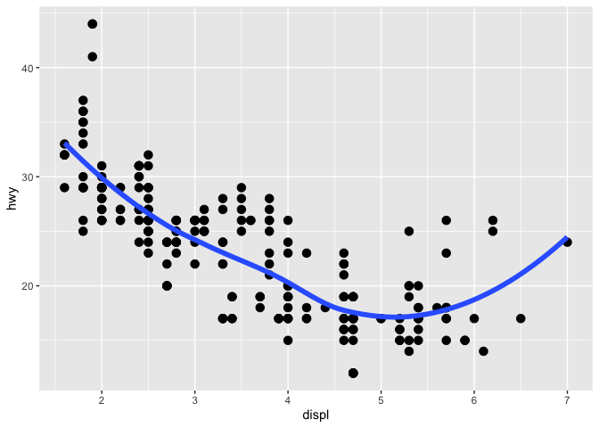
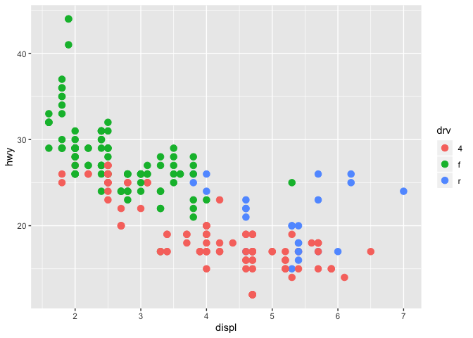

## 3.2.4 Exercises

1. Run ggplot(data = mpg). What do you see?
    + I see an empty graph
2. How many rows are in mpg? How many columns?
    + There are 224 rows and 11 columns
3. What does the drv variable describe? Read the help for ?mpg to find out.
    + drv describes if the car is a front-wheel, rear-wheel or four-wheel drive 
4. Make a scatterplot of hwy vs cyl.

```r
library(ggplot2)
ggplot(data=mpg) + 
  geom_point(mapping=aes(x=cyl, y=hwy)) 
```

<!-- -->

5. What happens if you make a scatterplot of class vs drv? Why is the plot not useful?
    + The plot isn't useful because it doesn't show you how mamy are in each class of vehicle

```r
library(ggplot2)
ggplot(data=mpg) + 
  geom_point(mapping=aes(x=drv, y=class))
```

<!-- -->

## 3.3.1 Exercises
1. What’s gone wrong with this code? Why are the points not blue?
    + The parenthesis is in the wrong place. It should be after "y=hwy" not after "blue."

```r
ggplot(data = mpg) + 
  geom_point(mapping = aes(x = displ, y = hwy, color = "blue"))
```

<!-- -->


```r
  ggplot(data = mpg) + 
   geom_point(mapping = aes(x = displ, y = hwy), color = "blue")
```

<!-- -->

2. Which variables in mpg are categorical? Which variables are continuous? (Hint: type ?mpg to read the documentation for the dataset). How can you see this information when you run mpg?
    + Categorical variables: manufacture, model, number of cylinders, transmission, type of drive, fuel type, class
    + Continuous variables: engine displacement, city miles per gallon, highway miles per gallon, year
    + You can see this information in a table form  


3. Map a continuous variable to color, size, and shape. How do these aesthetics behave differently for categorical vs. continuous variables? 


```r
ggplot(data = mpg) + 
     geom_point(mapping = aes(x = displ, y = hwy, size = cty))
```

<!-- -->

```r
ggplot(data = mpg) + 
     geom_point(mapping = aes(x = displ, y = hwy, color= cty))
```

<!-- -->

  + Q: What is the difference between a map and a plot. 
  + A continuous variable cannot be mapped to shape 
   

4. What happens if you map the same variable to multiple aesthetics?
    + Rstudio combined shape and color, but did not use size for a discrete variable


```r
ggplot(data = mpg) + geom_point(mapping = aes(x = displ, y = hwy, size = class, shape= class, color = class))
```

```
## Warning: Using size for a discrete variable is not advised.
```

```
## Warning: The shape palette can deal with a maximum of 6 discrete values
## because more than 6 becomes difficult to discriminate; you have 7.
## Consider specifying shapes manually if you must have them.
```

```
## Warning: Removed 62 rows containing missing values (geom_point).
```

<!-- -->

5. What does the stroke aesthetic do? What shapes does it work with? (Hint: use ?geom_point)
    + Stroke determines the the thickness of the outline of points. It works with open filled squares, circles, triangles and diamonds


6. What happens if you map an aesthetic to something other than a variable name, like aes(colour = displ < 5)? 
    + The aesthetic assigns a color to a point representing "true" or "false" based on the condition that "displ < 5"
  

```r
ggplot(data = mpg) + geom_point(mapping = aes(x=class, y =hwy,colour = displ <5))
```

<!-- -->

## 3.5.1 Exercises
1. What happens if you facet on a continuous variable?
    + You will may get an infinite number of plots 


2. What do the empty cells in plot with facet_grid(drv ~ cyl) mean? How do they relate to this plot?
    + The empty plots are another way to indicate there are no cars with rear-wheel drive that have 4 or 5 cylinders. The plot below is another representation of this. 
    

```r
ggplot(data = mpg) + 
  geom_point(mapping = aes(x = drv, y = cyl))
```

<!-- -->

3. What plots does the following code make? What does . do?
    + The . is a place holder and indicates that there is no other row or column variable to facet. The first graph is just comparing the highway mpg and engine displacement for different types of drives, while the second is comparing the highway mpg and engine displacement for cars with different numbers of cylinders. 
  

```r
ggplot(data = mpg) + 
  geom_point(mapping = aes(x = displ, y = hwy)) +
  facet_grid(drv ~ .)
```

<!-- -->

```r
ggplot(data = mpg) + 
  geom_point(mapping = aes(x = displ, y = hwy)) +
  facet_grid(. ~ cyl)
```

<!-- -->

4. Take the first faceted plot in this section: What are the advantages to using faceting instead of the colour aesthetic? What are the disadvantages? How might the balance change if you had a larger dataset?
    + Faceting makes it more clear to see the differences between within a group as each class is separated into a smaller plot.
    + However, it can be overwhelming if there are a large number of different classes, and you cannot see how the data overlaps. 

5. Read ?facet_wrap. What does nrow do? What does ncol do? What other options control the layout of the individual panels? Why doesn’t facet_grid() have nrow and ncol arguments?
    + nrow and ncol determine the number of rows and columns of each panel, essentially how long or tall each plot is.
    + strip.position, switch, drop, shrink, and scales also control the layout of panels
    + facet_grid() determines what variables are gonig to be faceted. 
  

6. When using facet_grid() you should usually put the variable with more unique levels in the columns. Why?
    + You want to do this to see the differences between the unique levels more easily  

## 3.6.1 Exercises
1. What geom would you use to draw a line chart? A boxplot? A histogram? An area chart?
    + You should use geom_smooth a line chart, geom_boxplot for a boxplot, geom_histogram for a histogram, and geom_area for an area chart. 
  
2. Run this code in your head and predict what the output will look like. Then, run the code in R and check your predictions.


```r
ggplot(data = mpg, mapping = aes(x = displ, y = hwy, color = drv)) + 
  geom_point() + 
  geom_smooth(se = FALSE)
```

```
## `geom_smooth()` using method = 'loess' and formula 'y ~ x'
```

<!-- -->

3. What does show.legend = FALSE do? What happens if you remove it?
Why do you think I used it earlier in the chapter?
    + The show.legend = FALSE removes the legend from the graph
    + If you remove the line of code the legend is given 
  

4. What does the se argument to geom_smooth() do?
    + The se argument controls if the confidence interval around the line willl be displayed
  

5. Will these two graphs look different? Why/why not?
    + Both the graphs are the same, because they plot the same data using the same two geoms. The first one is simply assigning the graphing technique to data, while the second assigns the data to each graphing technique 

6. Recreate the R code necessary to generate the following graphs.

```r
ggplot() + 
  geom_point(data = mpg, mapping = aes(x = displ, y = hwy), size =3) + 
  geom_smooth(data = mpg, mapping = aes(x = displ, y = hwy), se=FALSE, size=2)
```

```
## `geom_smooth()` using method = 'loess' and formula 'y ~ x'
```

<!-- -->

```r
ggplot() + 
  geom_point(data = mpg, mapping = aes(x = displ, y = hwy), size =3) + 
  geom_smooth(data = mpg, mapping = aes(x = displ, y = hwy, group=drv), se=FALSE, size=2)
```

```
## `geom_smooth()` using method = 'loess' and formula 'y ~ x'
```

<!-- -->

```r
ggplot() + 
  geom_point(data = mpg, mapping = aes(x = displ, y = hwy, color = drv), size =3) + 
  geom_smooth(data = mpg, mapping = aes(x = displ, y = hwy, color=drv), se=FALSE, size=2, show.legend=TRUE)
```

```
## `geom_smooth()` using method = 'loess' and formula 'y ~ x'
```

<!-- -->

```r
ggplot() + 
  geom_point(data = mpg, mapping = aes(x = displ, y = hwy, color = drv), size =3) + 
  geom_smooth(data = mpg, mapping = aes(x = displ, y = hwy), se = FALSE, size=2, show.legend=TRUE)
```

```
## `geom_smooth()` using method = 'loess' and formula 'y ~ x'
```

<!-- -->

```r
ggplot() + 
  geom_point(data = mpg, mapping = aes(x = displ, y = hwy, color = drv), size =3) + 
  geom_smooth(data = mpg, mapping = aes(x = displ, y = hwy, group =drv), se=FALSE, size=2, show.legend=TRUE)
```

```
## `geom_smooth()` using method = 'loess' and formula 'y ~ x'
```

<!-- -->

```r
ggplot() + 
  geom_point(data = mpg, mapping = aes(x = displ, y = hwy, color = drv), size =3, se=TRUE)  
```

```
## Warning: Ignoring unknown parameters: se
```

<!-- -->

  + Could not figure out how to get the blue line out of the legend for graph 4 
  + Could not figure out how to show standard error (?) for graph 6
